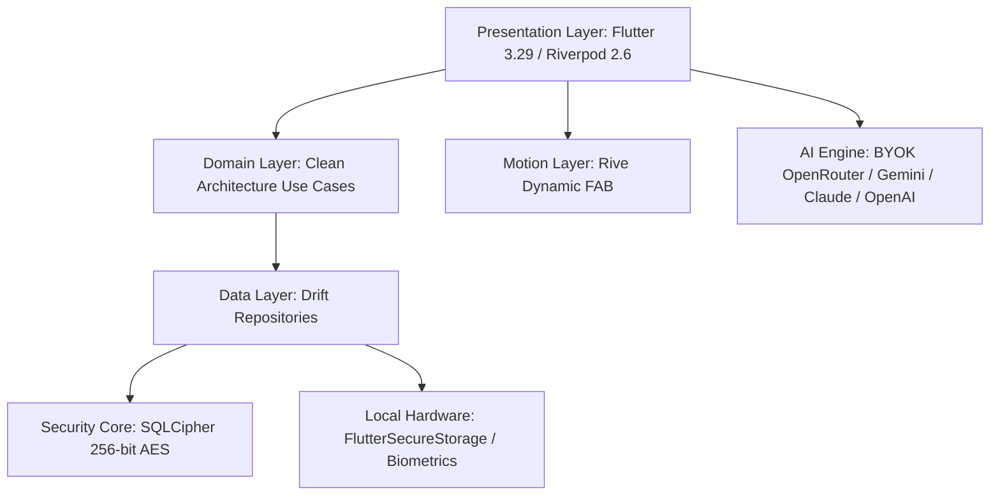

# PARIYOJANA (परियोजना) v1.0.0
### Sovereign Focus & Productivity Vault for Android 🇮🇳

[-FF522B?style=for-the-badge&logo=android&logoColor=white)](https://github.com/Naveen-21-Cyber/Pariyojana-Mobile-App-/releases/latest/download/Pariyojana.apk)
[](https://github.com/Naveen-21-Cyber/Pariyojana-Mobile-App-/releases)
[](http://pariyojana.gt.tc/)
[](LICENSE)
[](http://pariyojana.gt.tc/)
[](http://pariyojana.gt.tc/)

**Official Website:** [http://pariyojana.gt.tc/](http://pariyojana.gt.tc/)  
**GitHub Repository:** [https://github.com/Naveen-21-Cyber/Pariyojana-Mobile-App-](https://github.com/Naveen-21-Cyber/Pariyojana-Mobile-App-)

---

## 📥 1-Click Instant APK Download

<div align="center">
  <a href="https://github.com/Naveen-21-Cyber/Pariyojana-Mobile-App-/releases/latest/download/Pariyojana.apk">
    
  </a>
  <p><em>👉 Direct 1-Click Download: <strong><a href="https://github.com/Naveen-21-Cyber/Pariyojana-Mobile-App-/releases/latest/download/Pariyojana.apk">Pariyojana.apk (v1.0.0 Production Release)</a></strong></em><br/>
  Compatible with Android 10, 11, 12, 13, 14, and 15+ · Ultra-smooth 120 FPS</p>
</div>

---

## 🚩 Why "PARIYOJANA"?

Named after the Sanskrit word **परियोजना** (*Pariyojana* — *"A Plan of Noble Action"*), this app is crafted to restore complete personal data sovereignty to creators, developers, researchers, and students.

Unlike commercial tools that monetize your personal notes, project roadmaps, and job applications on remote surveillance clouds, **Pariyojana is 100% offline-first**. All your data lives exclusively on your local Android device in a 256-bit SQLCipher-encrypted database.

---

## 📸 Visual Showcase & App Tour

<div align="center">
  
  <p><em>Figure 1: Sovereign Command Dashboard, Dynamic Island, and Velvet Design Language.</em></p>
</div>

<br/>

<div align="center">
  <table>
    <tr>
      <td width="50%">
        
        <p align="center"><strong>1. Sovereign Idea Vault & Kanban</strong></p>
      </td>
      <td width="50%">
        
        <p align="center"><strong>2. Academic Research & Peer-Review Hub</strong></p>
      </td>
    </tr>
    <tr>
      <td width="50%">
        
        <p align="center"><strong>3. BYOK Multi-Model AI Studio</strong></p>
      </td>
      <td width="50%">
        
        <p align="center"><strong>4. Zero-Knowledge Biometric Vault</strong></p>
      </td>
    </tr>
    <tr>
      <td width="50%">
        
        <p align="center"><strong>5. Deep Work Focus Shield & Ambient Audio</strong></p>
      </td>
      <td width="50%">
        
        <p align="center"><strong>6. Sovereign Customization & Theme Matrix</strong></p>
      </td>
    </tr>
  </table>
</div>

---

## ✨ Core Pillars & Features

### 1. 💡 Idea Vault & Sovereign Cherishing System
- Capture thoughts, startup ideas, and research snippets instantly.
- Tag classification, importance scoring, and AI-driven expansion.
- Local AES-256 encrypted storage with instant zero-lag search.

### 2. 📋 Scrum & Agile Project Kanban Stage
- Full agile Kanban boards with custom swimlanes, WIP limits, and milestone metrics.
- Skeuomorphic folder trees with filesystem-grade storage asset indexing.
- Real-time GitHub commit telemetry and repository synchronization.

### 3. 📄 Academic Research Tracker & World of Science Revisions
- Comprehensive research paper tracker with SSRN Stall Detection.
- **World of Science Revisions Suite**: Track peer-review action items, editorial requirements, and reviewer comments.
- **AI Rebuttal Letter Generator**: Automatically draft formal scientific responses to journal reviewers.

### 4. 🤖 BYOK (Bring Your Own Key) Multi-Model AI Suite
- **OpenRouter (Recommended & Free Tier Ready):** Access DeepSeek R1, Llama 3.3 70B, Gemini 2.0 Flash Free, and Claude 3.5 Sonnet.
- **Direct Providers:** Native Gemini 2.0, OpenAI GPT-4o, Anthropic Claude, and Groq integration.
- **Zero Privacy Leakage:** API calls route directly from your device to the LLM provider. Zero intermediary logging.

### 5. 🛡️ Zero-Knowledge Biometric Vault & Anti-Forensics
- Fingerprint / PIN authenticated private partition.
- **Master API Key Safe**: Encrypted storage for all your developer API keys.
- **Anti-Forensic RAM Zeroing**: Instantly clears sensitive decrypted key buffers from device memory on lock.

### 6. 🎧 Focus Shield & Sacred Gita Wisdom
- Deep work distraction blocker with customizable focus countdown timers.
- Integrated ambient soundscapes: Daily Digest, Milestone Fanfare, Stealth Pulse, and Sacred Gita Om.
- Sacred Gita daily guidance for mental clarity, stoic resilience, and purpose.

### 7. ⚡ 120 FPS High-Performance Engine
- Hardware-accelerated Flutter 3.29 rendering pipeline.
- Lightweight translucent frosted glass architecture with `RepaintBoundary` isolation.
- Zero frame drops, zero unconstrained GPU overdraw, ultra-responsive touch gestures.

---

## 🏗️ Architecture & Tech Stack



- **Framework:** Flutter 3.29+ (Android Native)
- **State Management:** Riverpod 2.6 (Feature-First Clean Architecture)
- **Navigation:** GoRouter 17.0+ (Typed Routes)
- **Local Database:** Drift + SQLCipher (Encrypted SQLite at rest)
- **Security:** AES-256 Key Derivation, Zero-Knowledge Biometric Auth
- **Sound & Haptics:** AudioPlayers with asset-cached micro-tones

---

## 🛠️ Building from Source

### Prerequisites
- Flutter SDK `>=3.29.0`
- Android Studio / Android SDK `>=34`
- Java JDK 17+

### Step-by-Step Build

```bash
# 1. Clone the repository
git clone https://github.com/Naveen-21-Cyber/Pariyojana-Mobile-App-.git
cd Pariyojana-Mobile-App-

# 2. Install dependencies
flutter pub get

# 3. (Optional) Configure environment variables
cp .env.example .env

# 4. Run database & model generators
flutter pub run build_runner build --delete-conflicting-outputs

# 5. Build production APK
flutter build apk --release
```

The compiled APK will be located at: `build/app/outputs/flutter-apk/app-release.apk`.

---

## 🇮🇳 Made in India — For Sovereign Builders Worldwide

Pariyojana is built with passion and craftsmanship by an independent developer dedicated to user privacy, open systems, and digital sovereignty.

- **Developer:** [Naveen](https://github.com/Naveen-21-Cyber)
- **Website:** [http://pariyojana.gt.tc/](http://pariyojana.gt.tc/)
- **Repository:** [https://github.com/Naveen-21-Cyber/Pariyojana-Mobile-App-](https://github.com/Naveen-21-Cyber/Pariyojana-Mobile-App-)

---

## 📜 License

This project is licensed under the **MIT License** — see the [LICENSE](LICENSE) file for details.
