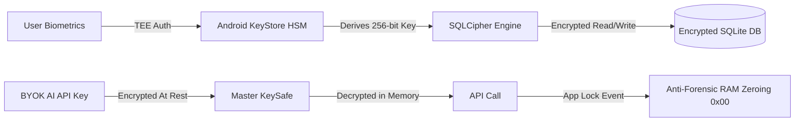
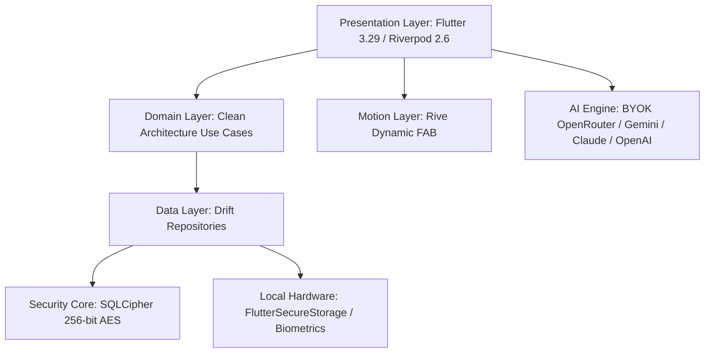

# PARIYOJANA (परियोजना) v1.1.2
### Sovereign Focus, Productivity & Research Vault for Android 🇮🇳

<div align="center">

[](https://github.com/Naveen-21-Cyber/Pariyojana-Mobile-App-/releases/download/v1.1.2/Pariyojana-v1.1.2.apk)
[](https://github.com/Naveen-21-Cyber/Pariyojana-Mobile-App-/releases/tag/v1.1.2)
[](http://pariyojana.gt.tc/)
[](LICENSE)
[](CONTRIBUTING.md)
[](SECURITY.md)
[](http://pariyojana.gt.tc/)

**[Official Website](http://pariyojana.gt.tc/)** · **[Download APK (v1.1.2)](https://github.com/Naveen-21-Cyber/Pariyojana-Mobile-App-/releases/download/v1.1.2/Pariyojana-v1.1.2.apk)** · **[Documentation](http://pariyojana.gt.tc/#features)** · **[Bug Report](https://github.com/Naveen-21-Cyber/Pariyojana-Mobile-App-/issues)** · **[Cyber_buddy](https://www.linkedin.com/company/cyber-buddy3/)**

</div>

---

## 📥 1-Click Instant APK Download

<div align="center">
  <a href="https://github.com/Naveen-21-Cyber/Pariyojana-Mobile-App-/releases/download/v1.1.2/Pariyojana-v1.1.2.apk">
    
  </a>
  <p><em>👉 Direct Download: <strong><a href="https://github.com/Naveen-21-Cyber/Pariyojana-Mobile-App-/releases/download/v1.1.2/Pariyojana-v1.1.2.apk">Pariyojana-v1.1.2.apk (v1.1.2 Production Release)</a></strong></em><br/>
  Compatible with Android 10, 11, 12, 13, 14, 15+ · 100% Free ($0) · No Sign-Up · No Ads · 120 FPS</p>
</div>

---

## 🌟 What's New in v1.1.2 — The Human-Centered Stability Release

- 🧭 **Humanized Feature Compass**: Jargon-free explanations, 3-step action recipes, and real-life everyday hacks across all 24 workspace capabilities.
- 🛡️ **Zero Data Deletion Guarantee**: Completely removed destructive database probe handlers; added automatic `.safety_bak` snapshots to ensure user data is never lost.
- 💻 **Cyber Command Terminal Outside Quick Access**: Instant 1-tap terminal launcher embedded directly in the Dynamic Island with responsive keyboard clamping.
- 🚀 **Guaranteed Executive Welcome Guide**: Newly registered accounts immediately experience the 5-page blueprint walkthrough.
- 🛡️ **Zero-Crash Resilience**: Full offline font protection, safe Riverpod provider lifecycles, and Android 12+ intent trampoline fixes.
- ⚡ **120 FPS Turbo Engine**: SQLite WAL (Write-Ahead Logging) mode, dedicated GPU repaint boundaries, and sub-millisecond local reads/writes.

---

## 🚩 Why "PARIYOJANA"?

Named after the Sanskrit word **परियोजना** (*Pariyojana* — *"A Plan of Noble Action"*), this app is crafted to restore complete personal data sovereignty to creators, developers, researchers, and students.

Unlike commercial tools that monetize your thoughts, project roadmaps, and career dossiers on remote surveillance clouds, **Pariyojana is 100% offline-first**. All your data lives exclusively on your local Android device in a 256-bit SQLCipher-encrypted database protected by Android KeyStore hardware enclaves.

> *"Master Your Execution. Guard Your Sovereignty."*  
> **योगः कर्मसु कौशलम्** *(Excellence in Action is Yoga)*

---

## 📸 Visual Showcase & Feature Tour

<div align="center">
  
  <p><em>Figure 1: Escape Corporate Surveillance — Move your professional execution into an encrypted vault on your device.</em></p>
</div>

<br/>

<div align="center">
  <table>
    <tr>
      <td width="33%">
        
        <p align="center"><strong>💡 Idea Vault</strong><br/><em>Zero-latency encrypted thought capture with priority taxonomy</em></p>
      </td>
      <td width="33%">
        
        <p align="center"><strong>📋 6-Stage Kanban</strong><br/><em>Visual workflow from Backlog to Shipped with streak heatmap</em></p>
      </td>
      <td width="33%">
        
        <p align="center"><strong>🔬 Research Vault</strong><br/><em>SSRN tracking, WoS review items & AI scientific rebuttal hub</em></p>
      </td>
    </tr>
    <tr>
      <td width="33%">
        
        <p align="center"><strong>💼 Job Pipeline</strong><br/><em>End-to-end career funnel & Indian New/Old LPA tax engine</em></p>
      </td>
      <td width="33%">
        
        <p align="center"><strong>🛡️ Biometric KeySafe</strong><br/><em>Master API keys hardware-sealed with RAM byte zeroing</em></p>
      </td>
      <td width="33%">
        
        <p align="center"><strong>⚡ In-App OTA Updater</strong><br/><em>1-tap seamless background updates & encrypted backup export</em></p>
      </td>
    </tr>
  </table>
</div>

<br/>

<div align="center">
  <h3>✨ Design Philosophy & Visual System</h3>
  <table>
    <tr>
      <td width="50%">
        
        <p align="center"><strong>1. Reclaim Your Digital Borders</strong><br/><em>Your Data · Your Device · Zero Subscriptions</em></p>
      </td>
      <td width="50%">
        
        <p align="center"><strong>2. Absolute Professional Vault</strong><br/><em>256-bit Encrypted Environment You Alone Control</em></p>
      </td>
    </tr>
    <tr>
      <td width="50%">
        
        <p align="center"><strong>3. Stop Losing Your Ideas</strong><br/><em>Idea Vault & Visual 6-Stage Kanban Board</em></p>
      </td>
      <td width="50%">
        
        <p align="center"><strong>4. Track Your Career Growth</strong><br/><em>Job Pipeline from Interview to Offer with Private Storage</em></p>
      </td>
    </tr>
    <tr>
      <td width="50%">
        
        <p align="center"><strong>5. Built for Deep Work</strong><br/><em>Ancient Indian Wisdom Meets Disruptive Hardware</em></p>
      </td>
      <td width="50%">
        
        <p align="center"><strong>6. Zero Tracking · Zero Fees</strong><br/><em>Your Logic Stays Local · 100% Free & Open Source</em></p>
      </td>
    </tr>
  </table>
</div>

---

## ⚔️ How Pariyojana Compares

| Feature | **Pariyojana** 🇮🇳 | Notion / Asana | Jira Cloud | Obsidian (Sync) |
|---|:---:|:---:|:---:|:---:|
| **Pricing** | **100% Free ($0 Lifetime)** | $10 – $25/mo | $8 – $15/user/mo | $4 – $8/mo |
| **Storage Architecture** | **Local Device Only** | Cloud Server | Cloud Server | Cloud Sync |
| **Database Encryption** | **SQLCipher 256-bit AES** | Plaintext on Server | Plaintext on Server | E2EE Add-on |
| **Hardware KeyStore Bound** | **✅ Android TEE HSM** | ❌ No | ❌ No | ❌ No |
| **Anti-Forensic RAM Zeroing**| **✅ Yes (Instant Wipe)** | ❌ No | ❌ No | ❌ No |
| **AI Intelligence Model** | **BYOK OpenRouter / Free** | $20/mo Addon | ❌ No | Plugin Dependent |
| **Account Requirement** | **Zero (No Account)** | Mandatory Account | Mandatory Account | Account for Sync |
| **Academic Rebuttal Hub** | **✅ Built-in** | ❌ No | ❌ No | ❌ No |
| **Open Source** | **✅ MIT Licensed** | ❌ Closed Source | ❌ Closed Source | ❌ Closed Source |

---

## ✨ Core Feature Modules

### 1. 💡 Sovereign Idea Vault & Cherishing System
- Capture thoughts, breakthrough startup concepts, and research sparks in seconds.
- Tag taxonomy, priority matrix, and AI-assisted idea expansion.
- Local AES-256 encrypted storage with instantaneous zero-latency search.

### 2. 📋 6-Stage Scrum & Agile Kanban Stage
- Visual pipeline: `Backlog` → `Sprint` → `In Progress` → `QA` → `Security Audit` → `Shipped`.
- Skeuomorphic folder trees with filesystem-grade asset indexing.
- 30-Day Activity Heatmap tracking daily consistency streaks.

### 3. 🌐 Academic Research Tracker & World of Science Revisions
- Study PDF library with SSRN submission stall detection.
- **World of Science Action Items**: Checklist for reviewer comments, revisions, and journal deadlines.
- **AI Rebuttal Generator**: Draft formal, courteous, and scientifically rigorous rebuttal letters to reviewers.

### 4. 🤖 BYOK (Bring Your Own Key) Multi-Model AI Studio
- **OpenRouter Support**: DeepSeek R1, Llama 3.3 70B, Gemini 2.0 Flash Free, Claude 3.5 Sonnet, and GPT-4o.
- **Zero Privacy Leakage**: Direct on-device HTTPS requests to LLM APIs. Zero intermediary servers.
- Model switcher allowing you to compare answers across multiple AI engines.

### 5. 💼 Job Application Tracker & Indian LPA Tax Engine
- End-to-end funnel: `Applied` → `Screening` → `Technical` → `HR` → `Offer` → `Rejected`.
- **LPA Tax & In-Hand Calculator**: New & Old Indian Tax Regime breakdown with monthly in-hand salary projections.
- AI Company Dossier generator & resume keyword matcher.

### 6. 🛡️ Biometric KeySafe & Anti-Forensic RAM Zeroing
- Fingerprint / PIN authenticated private partition.
- **Master API KeySafe**: Hardware-sealed storage for developer keys and credentials.
- **Anti-Forensics Engine**: Overwrites decrypted keys with zeroes (`0x00`) in RAM on app background/lock.

### 7. 🕉️ Focus Shield & Sacred Bhagavad Gita Wisdom
- Deep work distraction blocker with custom Pomodoro sprint durations.
- 15 curated Sanskrit Bhagavad Gita verses for equanimity, detachment from outcome, and stoic focus.
- Offline Vadya ambient soundscapes (*Daily Digest*, *Milestone Fanfare*, *Sacred Gita Om*).

### 8. ⚡ 120 FPS High-Refresh Velvet Engine
- Hardware-accelerated Flutter 3.29 rendering pipeline with `RepaintBoundary` isolation.
- Zero frame drops, fluid physics-based gestures, and battery-friendly dark mode.

---

## 🔒 Security & Threat Model



- **Encryption at Rest:** 256-bit AES cipher in CBC mode with 64,000 PBKDF2 iterations.
- **Key Derivation:** Hardware-backed Master Key derived via Android KeyStore TEE.
- **Memory Safety:** Anti-forensic byte clearing ensures zero decrypted keys remain in memory dumps.
- **Screenshot Protection:** DRM `FLAG_SECURE` prevents accidental OS recents caching.

---

## 🏗️ Architecture & Tech Stack



- **Framework:** Flutter 3.29+ (Android Native)
- **State Management:** Riverpod 2.6 (Feature-First Clean Architecture)
- **Navigation:** GoRouter 17.0+ (Typed Declarative Routes)
- **Local Database:** Drift + SQLCipher (Encrypted SQLite)
- **Haptics & Audio:** AudioPlayers with asset-cached micro-tones

---

## 🛠️ Building from Source

### Prerequisites
- Flutter SDK `>=3.29.0`
- Android Studio / Android SDK `>=34`
- Java JDK 17+

### Step-by-Step Build

```bash
# 1. Clone the repository
git clone https://github.com/Naveen-21-Cyber/Pariyojana-Mobile-App-.git
cd Pariyojana-Mobile-App-

# 2. Install dependencies
flutter pub get

# 3. (Optional) Configure environment variables
cp .env.example .env

# 4. Run database & code generators
flutter pub run build_runner build --delete-conflicting-outputs

# 5. Build optimized production APK
flutter build apk --release --no-tree-shake-icons
```

The compiled APK will be at: `build/app/outputs/flutter-apk/Pariyojana.apk`.

---

## 🗺️ Product Roadmap

- [x] **v1.0.0 (Aug 15, 2026 — 80th Independence Day Launch):**
  - Production-ready release with 256-bit SQLCipher local database.
  - BYOK AI Studio (OpenRouter, DeepSeek R1, GPT-4o, Claude 3.5, Gemini 2.0 Flash).
  - World of Science Revisions Suite & SSRN Stall Detector.
  - Job Application Tracker & Indian LPA Tax Engine.
  - Bhagavad Gita Focus Shield & Vadya soundscapes.
  - ProGuard/R8 optimized release (`Pariyojana.apk`).
- [x] **v1.1.0 (Aug 18, 2026 — Security Hardening & In-App OTA Update):**
  - Direct in-app OTA update engine with live download progress & 1-tap package installer (`REQUEST_INSTALL_PACKAGES`).
  - Asset security: `.env` completely isolated from embedded APK bundle to eliminate decompile footprint.
  - Network security config hardened against user-CA MITM attacks.
  - Hardware KeyStore scoped wipe logic preventing transient key destruction.
- [x] **v1.1.1 (Aug 18, 2026 — Google Fonts Crash Fix & Amazon Appstore Compliance):**
  - Font Engine: Resolved runtime fetching exception on typography engine; dynamic font selection across 7+ font families.
  - Stability & Lifecycle: Fixed Riverpod state disposal race condition in Master PIN and registration setup.
  - Amazon Fire OS Compatibility: Instant touch feedback and native Account Link dialog fallback for non-GMS devices.
  - Production App Bundle (`Pariyojana-v1.1.1.aab`) & Direct APK (`Pariyojana-v1.1.1.apk`).
- [ ] **v1.2.0 (Q4 2026):**
  - Git synchronization for encrypted `.velvet` backup archives.
  - Sanskrit & Hindi native Text-to-Speech for daily Gita shlokas.
  - On-device lightweight vector search for local note embeddings.
- [ ] **v2.0.0 (2027):**
  - Decentralized local-network P2P sync via libp2p.
  - Cross-device companion desktop bridge.

---

## ❓ Frequently Asked Questions (FAQ)

<details>
<summary><strong>Is Pariyojana really 100% free with no hidden subscriptions?</strong></summary>
<p>Yes! Pariyojana is 100% Free ($0 Lifetime) and licensed under the permissive MIT open-source license. There are no paywalls, locked features, or trial periods.</p>
</details>

<details>
<summary><strong>Do I need an internet connection to use Pariyojana?</strong></summary>
<p>No! Pariyojana is 100% offline-native. All notes, projects, research papers, and job dossiers are stored directly on your phone. Internet access is only needed when you query online AI models using your BYOK key or check for GitHub updates.</p>
</details>

<details>
<summary><strong>How are my AI API keys protected?</strong></summary>
<p>Your API keys are encrypted at rest using your device's Android KeyStore TEE Hardware Enclave. Decrypted keys only exist in RAM during the duration of an API call and are immediately zeroed out (<code>0x00</code>) when the app is locked or sent to the background.</p>
</details>

<details>
<summary><strong>How do I create backups of my data?</strong></summary>
<p>You can export AES-256 encrypted <code>.velvet</code> backup files at any time from <strong>Settings → Export Backup</strong>. You can restore your data onto any Android device running Pariyojana.</p>
</details>

---

## 🤝 Community & Contributing

Pariyojana is built for the global open-source community by sovereign developers. We welcome contributions from builders worldwide!

- 🐛 **Found a bug?** Open a [Bug Report](https://github.com/Naveen-21-Cyber/Pariyojana-Mobile-App-/issues).
- 💡 **Have a feature idea?** Submit a [Feature Request](https://github.com/Naveen-21-Cyber/Pariyojana-Mobile-App-/issues).
- 🛠️ **Want to write code?** Check out [CONTRIBUTING.md](CONTRIBUTING.md) and pick up a `good first issue`.
- ⭐ **Love the project?** Give us a star on GitHub — it helps Pariyojana reach more sovereign builders!

---

## 🇮🇳 Made in India — For Sovereign Builders Worldwide

Pariyojana is proudly designed, engineered, and maintained with passion under **Cyber_buddy** for builders worldwide who care about digital freedom, privacy, and craftsmanship.

- **Organization:** [Cyber_buddy on LinkedIn](https://www.linkedin.com/company/cyber-buddy3/)
- **Lead Developer:** [Naveen](https://github.com/Naveen-21-Cyber)
- **Website:** [http://pariyojana.gt.tc/](http://pariyojana.gt.tc/)
- **Repository:** [https://github.com/Naveen-21-Cyber/Pariyojana-Mobile-App-](https://github.com/Naveen-21-Cyber/Pariyojana-Mobile-App-)

---

## 📜 License

This project is licensed under the **MIT License** — see the [LICENSE](LICENSE) file for details.
