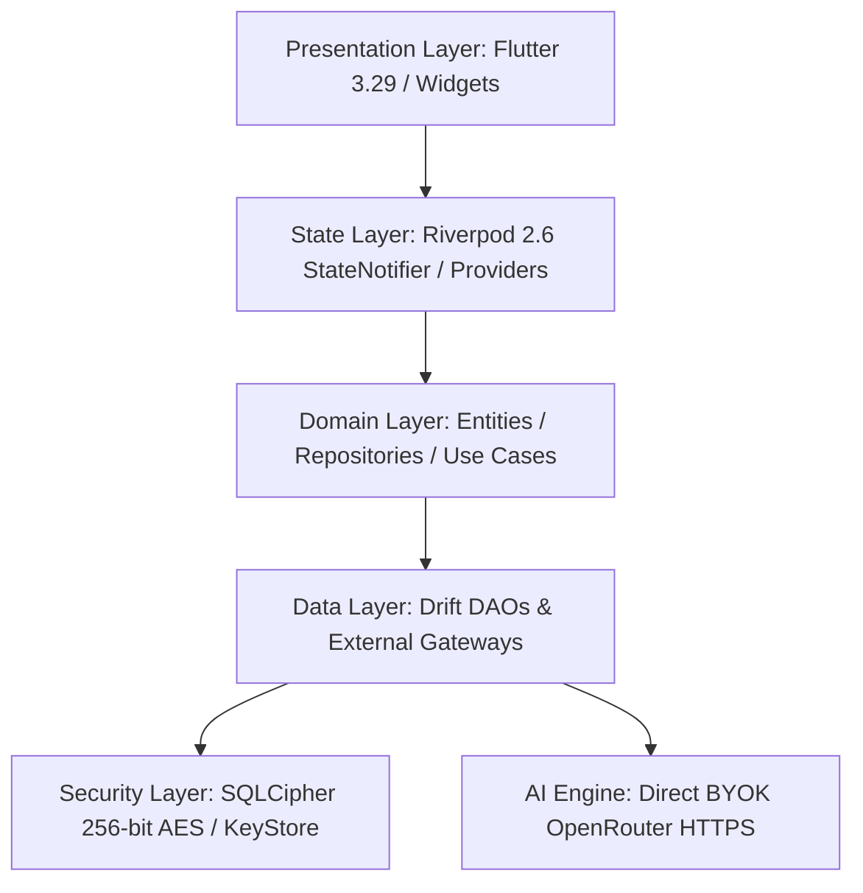
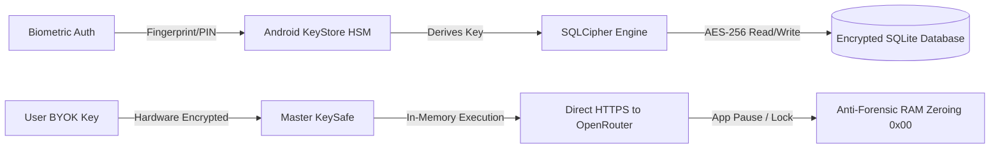

# 📜 TELOS.md — The Architectural Soul & Product Constitution of Pariyojana

> **Project:** PARIYOJANA (परियोजना) v1.0.0  
> **Entity:** Cyber_buddy ([LinkedIn](https://www.linkedin.com/company/cyber-buddy3/))  
> **Lead Architect:** Naveen ([@Naveen-21-Cyber](https://github.com/Naveen-21-Cyber))  
> **Target OS:** Android 10+ (Android-Exclusive Native Flutter)  
> **Motto:** *"Master Your Execution. Guard Your Sovereignty."* · **योगः कर्मसु कौशलम्**  

---

## 🏛️ 1. The Core Telos (Ultimate Purpose)

The *telos* (ultimate purpose and raison d'être) of **Pariyojana** is to restore **absolute data sovereignty, uninterrupted cognitive focus, and uncompromised intellectual privacy** to builders, researchers, developers, and creators worldwide.

### The Problem with Cloud Surveillance
Contemporary productivity ecosystems (Notion, Jira, Obsidian Cloud Sync, Todoist) operate on a recurring rentier model ($10–$25/month) and centralize private thoughts, unreleased startup blueprints, proprietary research notes, and career dossiers on remote, corporate surveillance servers. 

### The Pariyojana Paradigm
Pariyojana operates on a radical counter-philosophy:
1. **Local-First & Offline-Native:** Your data lives only on your physical Android hardware. No background telemetries, no server-side parsing.
2. **Zero-Knowledge Encryption:** The entire SQLite database is encrypted at rest using **SQLCipher 256-bit AES**.
3. **Hardware Enclave Bound:** Master encryption keys are derived through the **Android KeyStore Trusted Execution Environment (TEE)**.
4. **Zero Intermediary AI (BYOK):** Connect your own OpenRouter / OpenAI / Anthropic / Gemini API keys directly via HTTPS from your device without third-party proxies or logging.
5. **100% Free & Open Source ($0 Lifetime):** MIT-licensed, community-owned, ad-free, and subscription-free.

---

## 🏗️ 2. Architectural Constitution (Non-Negotiable Invariants)

Every line of code written for Pariyojana MUST adhere strictly to the following invariants:



### 1. Clean Architecture (Feature-First)
Every feature directory MUST maintain three distinct separation layers:
- `data/`: Repositories, Drift DAOs, DTOs, external API clients.
- `domain/`: Pure Dart entities, failure types, abstract repository interfaces, business logic.
- `presentation/`: Riverpod providers, screens, and reusable widgets. **Zero business logic inside widgets.**

### 2. State Management Standard
- **Riverpod only** (`flutter_riverpod` 2.6+).
- Ephemeral UI state (animation controllers, scroll offsets, text field focus) belongs in `StatefulWidget` / `State`.
- Shared, domain, and persistence state MUST flow through Riverpod providers. No `setState`-driven app architecture.

### 3. Local Database & Crypto Boundary
- **Drift + SQLCipher**: The local database file MUST remain encrypted at rest with 256-bit AES-CBC (64,000 PBKDF2 iterations).
- Never introduce a secondary unencrypted cache or storage mechanism.
- Persistence of secrets/keys MUST use `flutter_secure_storage` backed by Android KeyStore hardware.

### 4. Navigation Standard
- **GoRouter 17.0+** with typed declarative routes and shell route navigation.

---

## 🎨 3. Design System & Tri-Modal Aesthetics

Pariyojana blends three curated aesthetic languages without visual collision:

| Aesthetic Language | Applied Scope | Visual Tokens |
|---|---|---|
| 🧊 **Glassmorphism** | Top navigation bar, dynamic island, modal overlays, snackbars | `BackdropFilter` (blur: 15–20px), `rgba(255,255,255,0.06)` border, specular highlights |
| 🧱 **Claymorphism** | Content cards, metric containers, dashboard widgets | Soft dual shadows (inner light + ambient dark), rounded corners (20–24px), tactile depth |
| 📁 **Skeuomorphism** | Project directory tree, filesystem asset registers | Realistic folder tabs, brass rivets, file metadata textures |

### Motion Element
- **Liquid FAB via Rive**: One signature interactive motion element. Motion is applied with restraint to maintain 120 FPS high-refresh stability without GPU jitter.

---

## 📦 4. Core System Modules Overview

```
lib/
├── core/                        # Global foundational services
│   ├── database/                # Drift + SQLCipher encrypted database engine
│   ├── home_widget/             # Android Home Screen AppWidget provider
│   ├── notifications/           # Notification scheduler & background triggers
│   ├── security/                # Android KeyStore, biometrics & anti-forensic zeroing
│   ├── services/                # GitHub release update checker
│   ├── sounds/                  # AudioPlayers & asset-cached soundscapes
│   └── theme/                   # Velvet token palette & typography providers
├── features/
│   ├── ai_agents/               # BYOK OpenRouter multi-model studio & token optimizer
│   ├── analytics/               # 30-Day habit heatmap & velocity analytics
│   ├── command_center/          # Sovereign central dashboard & skill tree radar
│   ├── focus_shield/            # Distraction blocker & Pomodoro timer
│   ├── hacker_news/             # Curated developer tech feed (offline-cached)
│   ├── idea_vault/              # Sovereign idea capture & semantic tagging
│   ├── job_tracker/             # Career pipeline, company dossiers & LPA tax engine
│   ├── project_tracker/         # 6-stage Kanban board & folder asset trees
│   ├── research_tracker/        # World of Science revisions, SSRN stall detector, AI rebuttal
│   ├── route_map/               # Milestone route planning
│   └── settings/                # Security preferences, BYOK KeySafe & export engines
└── shared_widgets/              # Cross-module design tokens & velvet widgets
```

---

## 🛡️ 5. Security & Threat Model



1. **Anti-Forensic RAM Zeroing:** Decrypted API keys and sensitive tokens are wiped (`0x00`) from volatile RAM immediately upon application backgrounding or biometric lock.
2. **DRM Screenshot Protection:** Native `FLAG_SECURE` prevents Android OS recents screenshots and memory-dump capture.
3. **Zero Secret Hardcoding:** API keys and credentials are never stored in source code; persisted solely in Android KeyStore TEE.

---

## 🚀 6. Release & Versioning Strategy

- **v1.0.0 (Launch — Aug 15, 2026 / 80th Independence Day):** Production-ready release with SQLCipher, BYOK AI Studio, World of Science Hub, Job Tracker + LPA Tax Engine, Bhagavad Gita Focus Shield, and ProGuard/R8 optimization.
- **v1.1.0 (Planned):** Git synchronization for encrypted `.velvet` backups, localized Hindi/Sanskrit TTS for Gita verses, and offline vector embeddings.
- **v2.0.0 (Long-Term):** Decentralized peer-to-peer encrypted sync via Tor/libp2p.

---

## 🇮🇳 7. Authorship & Organization

- **Parent Organization:** Cyber_buddy ([LinkedIn](https://www.linkedin.com/company/cyber-buddy3/))
- **Lead Developer:** Naveen ([GitHub](https://github.com/Naveen-21-Cyber))
- **License:** MIT License (Open Source)
- **Philosophy:** Digital Sovereignty & Craftsmanship 🇮🇳
